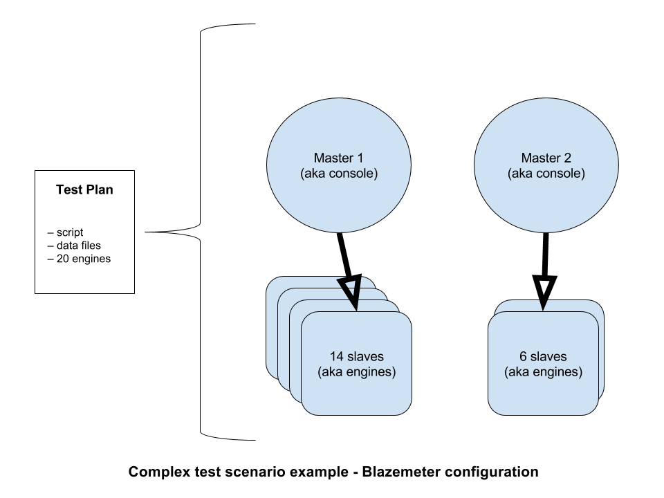
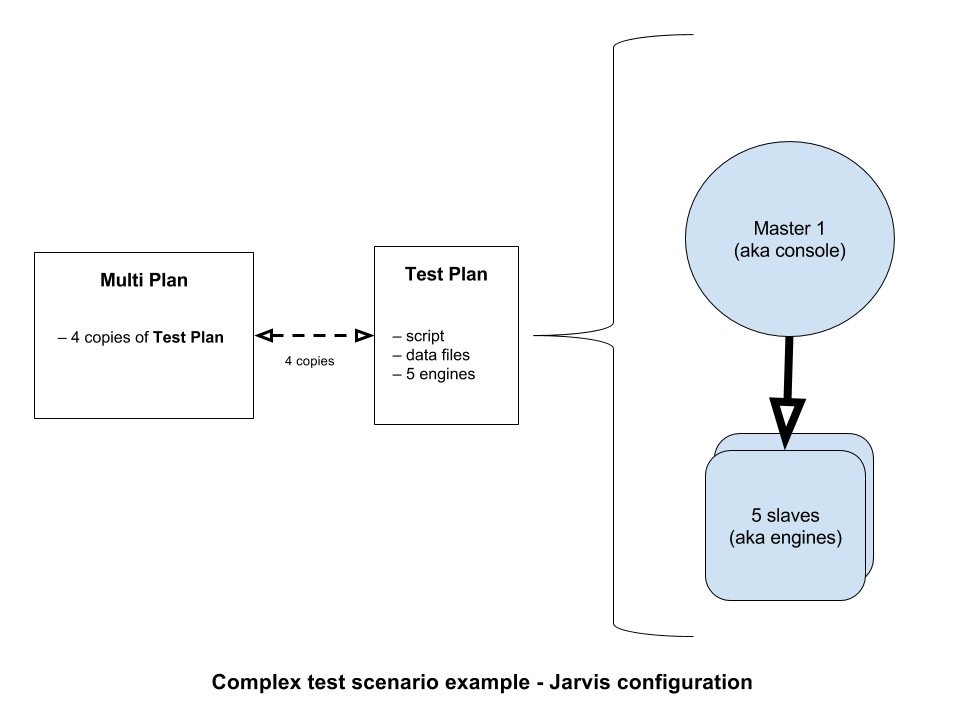
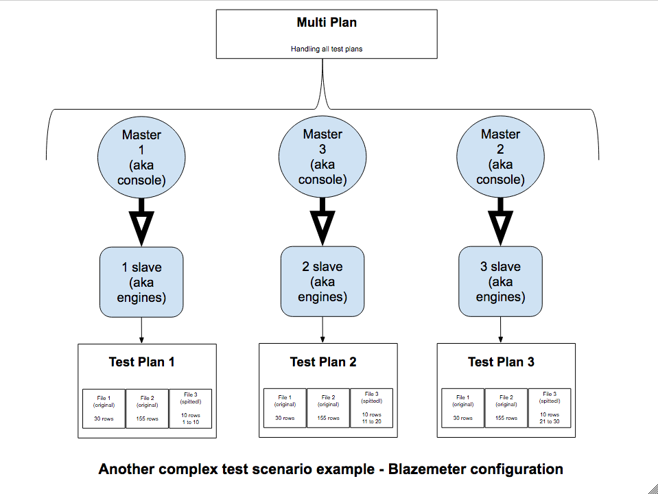

# Jarvis Project

Jarvis is a command-line tool that provides integration with Blazemeter APIs, helping teams to create and run tests fast and constantly over Blazemeter platform.

Jarvis aims to be a simple way to maintain large tests over Blazemeter, providing automated and simple configuration to handle lots of scripts and data files.

Plus, Jarvis provide 2 great *workaround* features:

1. Engine per console configuration.
2. Split CSV to specifc file.

## Table of Contents
* [Features](#features)
    * [1. Test plan configuration](#1.-test-plan-configuration)
    * [2. Multi test configuration](#2.-multi-test-configuration)
* [Plus: Workaround Features](#plus:-testing-features)
    * [1. Engine per console configuration](#1.-engine-per-console-configuration)
    * [2. Split CSV to specifc file](#2.-split-csv-to-specifc-file)
* [Usage](#usage)
* [TO DOS](#to-dos)

## Features

### 1. Test plan configuration

TODO: feature details

### 2. Multi test configuration

TODO: feature details

## Plus: Workaround Features

### 1. Engine per console configuration

Engine per console is the same as slaves per master.

*Why is it interesting? When can you use it?*

Blazemeter solves the distribution of slaves per master automatically. It's transparent and simple to the final user. However, we experienced some troubles when running large scale tests, because the master was unable to handle the amount of its slaves when running some complex test scripts.

#### Contextualizing the problem

There is a complex test scenario, that need 20 slaves (aka engines) to reproduce the desired load. Blazemeter's platform will group at least 14 slaves under each master.

So this is the automatically master x slave configuration provided:

During various tests the *Master 1* crashed because of the complexity of some specific test scripts. The result of this crash was that the tests do not reached the load goal.

We've experimented different configurations to figure out that the master was able to handle groups with less slaves. Sometimes 5 slaves, sometimes 8 slaves (depending on the test script) and so on. In this specific example, we figured out that 5 slaves was the limit for each master.

Blazemeter do not provide a feature to decide how many slaves the masters will handle, so the workaround for this problem was create 1 test plans with 5 slaves and copy this test plan 4 times inside a Multi Plan.

It looks like this:

We did this workaround many times manually and it's real hard-working. So we decided automatize it inside Jarvis. :)

### 2. Split CSV to specifc file

Blazemeter offers a feature that splits all data files inside a test plan to each slave (aka engine) automatically, but when you need to split just one or another specific file?

#### Contextualizing the problem

In another complex test scenario, we have 20 data files for one test script. Just 2 of this files needs to be splitted. We need 10 slaves to reproduce the desired load. There is no way to do that configuration on Blazemeter. So the resolution was to split manually each file and create each one of this desired slaves separately.

Looks this way with Blazemeter resources:

The image is a reduced version of the scenario. But the idea is here: for a unique test plan, because of the necessity of split some specific files, was necessary to configure each *engine* as a unique *test plan*, increasing time spent and risks of human mistakes.

## Usage

TODO: examples

## TO DOS

We are developing new features to Jarvis:
- Command-line test:
  - _Execution_, with the list of available test plans and multi plans to start;
  - _Monitoring_, with automatically stops criteria.
- Tests result consolidate by KPIs mapping (no 100 labels limitation).
